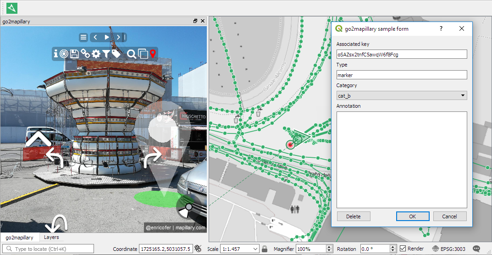
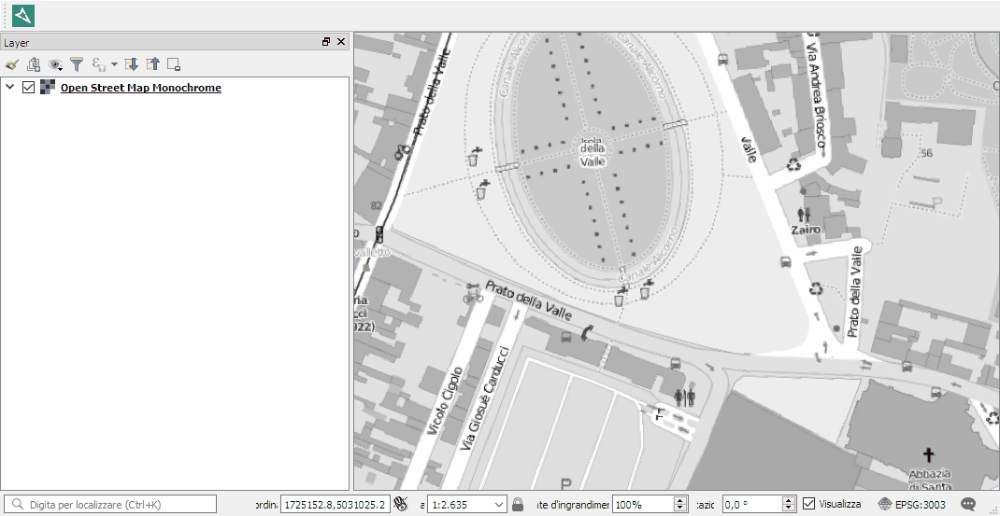
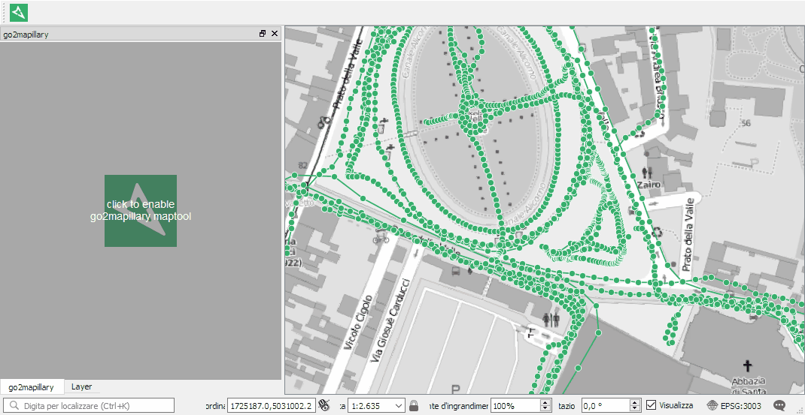
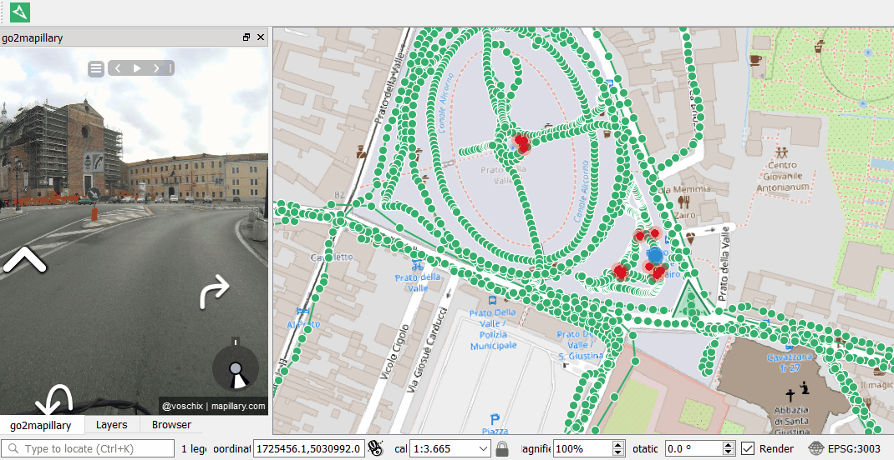
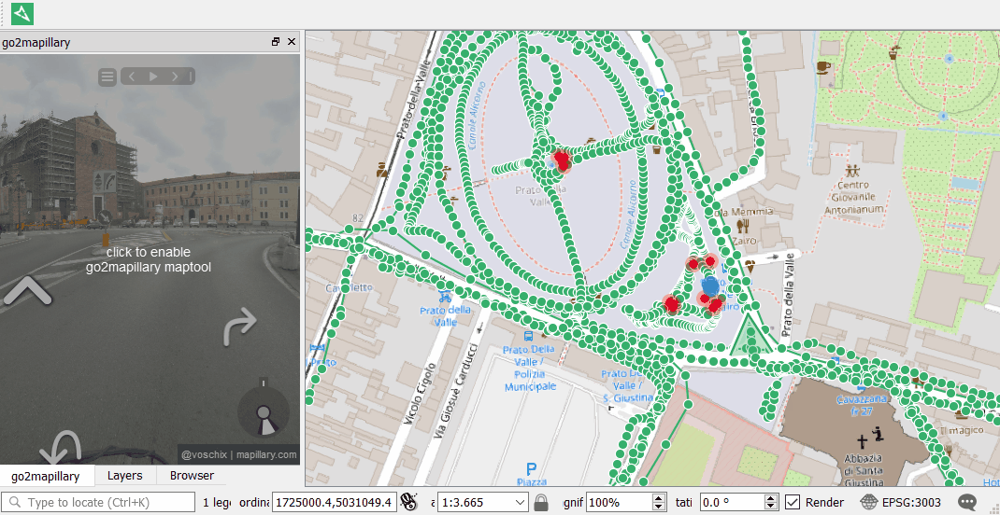
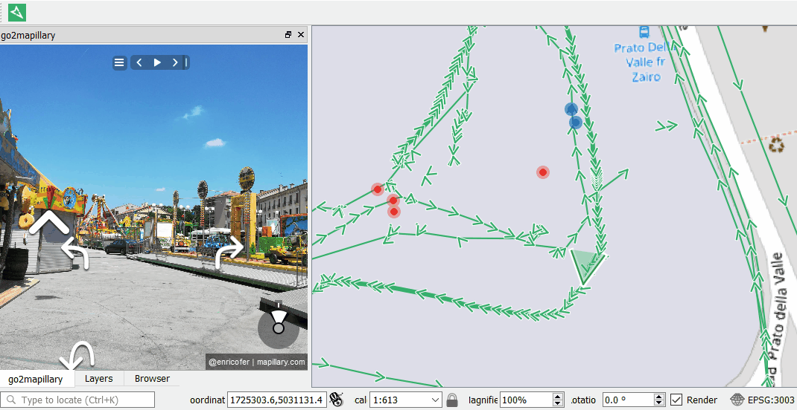
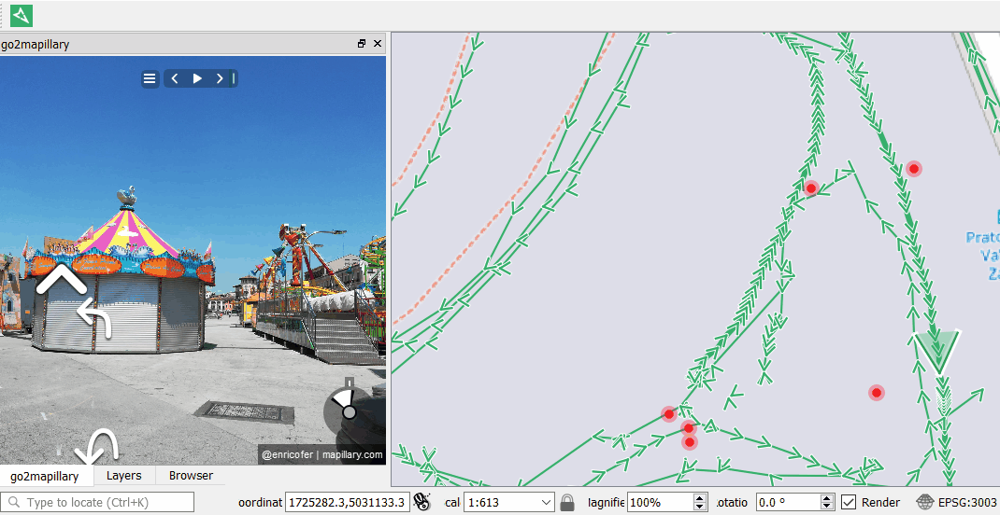
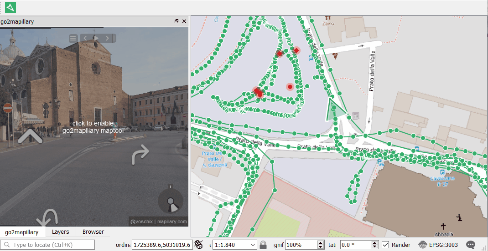
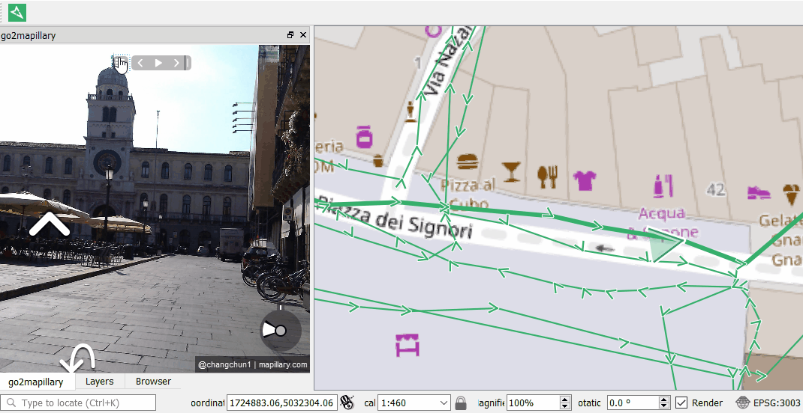
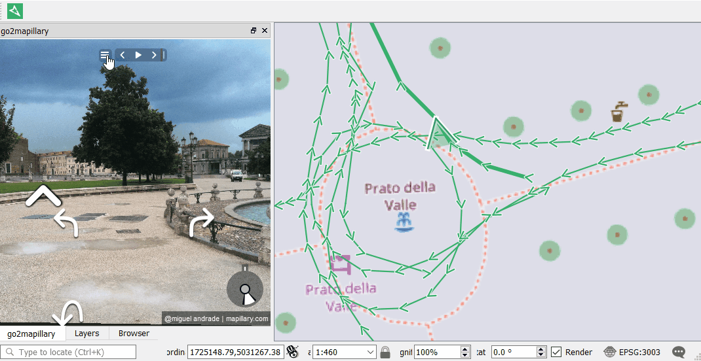

# go2mapillary #
#### a QGIS3 plugin for browsing mapillary street level imagery

The plugin allows to browse mapillary street level imagery and interact with mapillary service for analysis and information extraction from within QGIS.

### Activation
Once installed the main plugin dialog can be activated/deactivated clicking on go2mapillary tool button. While the main dialog appears on the left docking area, the plugin downloads the mapillary coverage for the current map canvas extent. The download and caching progress of mapillary coverage vector tiles appears as user message bar on the top of map canvas. The mapillary coverage is stored in three layers: images, sequences and overview grouped in mapillary legend folder which visibility depends from map canvas scale.

### Browsing
At first use, the main dialog shows only mapillary logo and waits for a mouse click on the mapillary coverage currently loaded on map canvas to open the related image. Every feature (image, sequence or overview) has a key id to a mapillary street level image from which can be accessed other images related to the same sequence or by proxymity whit the common mapillary interface widgets (sequence and navigation toolbox). The location of image on map canvas is marked by a symbol showing the direction of view.
The image browsing dialog remains

### Sampling utilities
The plugin allows to extract informations from visible image tagging it or locating georeferenced markers on it associating with with categorized annotation. These extracted informations are stored in a dedicated layer named *"mapillary samples"* along with the related image key.

### Interactions
The common mapillary interface has been integrated with a custom menu button located at the left of sequence toolbar from which can be accessed further functions related to information extraction.

#### Info button
Info button shows all the information about the current image: User name, User key, shot time, location, camera model and type, field of view and related sequence.

#### Center button
this button pans the canvas centering the view on current image location without changing the zoom factor. This could be useful to recenter the location marker on map after following the images sequence.

#### Save button
The function saves locally, for further processing, the current image high resolution file.

#### Link button
This function opens in the default browser the mapillary showing the currently loaded image.

#### Filter button
The button opens the filter dialog that allows to filter the mapillary coverage by date, by User, by "looking at" direction or only equirectangular panoramic views.

#### Settings button
This menu item shows the settings menu allowing to specify the datasource target of mapillary samples layer (memory temporary layer or a shapefile), define the categories and the associated color set, and control the samples editing form visualization.

#### Tag button
This function allows to define a rectangular tag over the current image and associate it to a categorized annotation. The tag is stored in mapillary samples layer and is redrawn everytime the related image is visualized in mapillary dialog. The tagging is stored locally and it is not related to mapillary tagging service, actually not available for custom applications.

#### Modes buttons
The last three items on the right of plugin menu activate one of the mutually exclusive available interaction modes: zoom mode, compare mode and markers mode. The current mode icon appears in red color

- zoom mode: The mode allows to zoom in double clicking on the image and zoom out double clicking holding shift button
- compare button: This mode activate the compare component showing the diffences between a background and a foreground images moving a slider widget on the bottom of the dialog. When activated the current image become the foreground image, visible pulling the slider to the right and located on map canvas with the blue marker. The background images to be compared in the dialog could be selected with further mouse click over mapillary coverage, are visible pulling the slider to the right and located on the map with the red marker.
- markers mode: the markers mode allows to point and click in perspective in the current image and create geolocated markers. Dragging the mouse cursor over the image appears the digitizing cursor over the map canvas showing the corrected location of the image (see [changesets](https://www.mapillary.com/developer/api-documentation/#changesets)), the dragging cursor reprojected over the map and the line of sight axis. Clicking on image dialog the marker become visible, is stored on mapillary samples layer and can be related with categorized annotations. Once created, markers can be further dragged, edited or deleted to adjust or correct related informations.

Zoom Mode:

Console Mode:

Markers Mode:

